# Gemini Native Workspace Standard (Grand Unified v2026.26)

**Philosophy:** "Headless Organization"

**Goal:** Create self-contained, intelligent workspaces that evolve over time, scalable from simple scripts to enterprise platforms.

## **TL;DR - Quick Reference**

| Tier           | When to Use                              | Bootstrap Command                                        |
| :------------- | :--------------------------------------- | :------------------------------------------------------- |
| **Lite**       | Single-file scripts, cron jobs, scrapers | `python bootstrap.py -t 1 -n mybot` (or `--tier 1`)      |
| **Standard**   | Web apps, CLI tools, libraries           | `python bootstrap.py -t 2 -n myapp` (or `--tier 2`)      |
| **Enterprise** | SaaS platforms, multi-agent systems      | `python bootstrap.py -t 3 -n myplatform` (or `--tier 3`) |

**Additional Commands:**
- `--validate ./path` - Validate existing workspace
- `--upgrade ./path` - Upgrade workspace to next tier
- `--rollback ./path` - Rollback workspace from upgrade backup
- `--backup NAME` - Specific backup to restore (use with --rollback)
- `-y` / `--yes` - Skip confirmation prompts (for CI/CD automation)
- `--update-scripts ./path` - Update scripts without full upgrade
- `--shared-agent ./path` - Link to shared `.agent/` directory
- `--from-template NAME` - Use template (fastapi, cli, scraper)
- `--export-template ./path` --template-name NAME - Export workspace as template
- `--list-templates` - Show available templates
- `--run-self-tests` - Run internal unit tests for bootstrap script
- `--dry-run` - Preview without creating files
- `--git` - Initialize git repository
- `--force` - Overwrite existing directory
- `--quiet` / `--verbose` - Control output verbosity
- `--no-color` - Disable colored output (for CI/logging)
- `--config PATH` - Use custom config file
- `--validate-schemas PATH` - Validate JSON files against schemas
- `--python-version VERSION` - Set Python version for CI (default: 3.11, must be 3.10+)
- `-V` / `--version` - Display script version


> [!IMPORTANT]
> **Requires Python 3.10+** • Primarily designed for **Unix-like systems** (macOS, Linux). Windows users should use WSL or Git Bash for full compatibility. See [Platform Compatibility](#m-platform-compatibility) for details.

### **Quick Decision Tree**

```mermaid
flowchart TD
    Start[New Gemini Project] --> Q1{Need automated<br/>testing?}
    Q1 -->|No - Simple scripts| T1[🟦 Lite Tier]
    Q1 -->|Yes| Q2{Need domain<br/>isolation?}
    Q2 -->|No - Single app| T2[🟩 Standard Tier]
    Q2 -->|Yes - Platform/SaaS| T3[🟪 Enterprise Tier]
    
    T1 --> D1[Flat src/main.py<br/>No tests<br/>Cron jobs, scrapers]
    T2 --> D2[Modular src/pkg/<br/>Full test suite<br/>Web apps, CLIs]
    T3 --> D3[Isolated domains<br/>Multi-agent contracts<br/>SaaS platforms]
    
    style T1 fill:#e3f2fd
    style T2 fill:#e8f5e9
    style T3 fill:#f3e5f5
    style Start fill:#fff9c4
```



---

## **Table of Contents**

1. [The Three Tiers](#1-the-three-tiers-architecture-strategy)
2. [Universal Core](#2-universal-core-applies-to-all-tiers)
3. [Module A: Lite Edition](#3-module-a-lite-edition-automation)
4. [Module B: Standard Edition](#4-module-b-standard-edition-product)
5. [Module C: Enterprise Edition](#5-module-c-enterprise-edition-platform)
6. [Multi-Workspace Coordination](#6-multi-workspace-coordination)
7. [Templates](#7-templates)
8. [Migration Path](#8-migration-path)
9. [Feature Comparison Matrix](#9-feature-comparison-matrix)
10. [Observability & Monitoring](#r-observability--monitoring-enterprise-tier)
11. [Deployment Pipelines](#s-deployment-pipelines-enterprise-tier)
12. [Future Roadmap](#10-future-roadmap)
13. [Real-World Examples](#11-real-world-examples)
14. [Version History](#version-history)
15. [Glossary](#glossary)

**Universal Core Sub-sections:**
- [A. Workspace Metadata](#a-workspace-metadata-geminiworkspacejson)
- [B. Cognitive Layer](#b-the-cognitive-layer-agent)
- [C. Session Management](#c-session-management)
- [D. Skill Management](#d-skill-management-registry)
- [E. Snapshot & Restore](#e-snapshot--restore)
- [F. Evolution Protocol](#f-the-evolution-protocol-the-gardener)
- [G. Archive Workflow](#g-archive-workflow)
- [H. Universal Laws](#h-universal-laws-the-constitution)
- [I. Context Slicing](#i-context-slicing-geminimanifests)
- [J. VS Code Integration](#j-vs-codeide-integration)
- [K. Continuous Integration](#k-continuous-integration-cicd)
- [L. Security Best Practices](#l-security-best-practices)
- [M. Troubleshooting](#m-quick-troubleshooting)
- [N. Platform Compatibility](#n-platform-compatibility)
- [O. Pre-commit Hooks](#o-pre-commit-hooks)
- [P. JSON Schemas](#p-json-schemas-ide-support)
- [Q. First-Run Experience](#q-first-run-experience-make-onboard)
- [R. Health Dashboard](#r-health-dashboard-make-status)

---

## **1. The Three Tiers (Architecture Strategy)**

Choose the architecture that matches your complexity.

| Feature       | Lite (Bot)                   | Standard (Product)        | Enterprise (Platform)         |
| :------------ | :--------------------------- | :------------------------ | :---------------------------- |
| **Use Case**  | Scripts, Scrapers, Cron Jobs | Web Apps, CLIs, Libraries | SaaS, Multi-Agent Systems     |
| **Logic**     | Flat (`src/main.py`)         | Modular (`src/pkg/`)      | Isolated (`src/domains/`)     |
| **Brain**     | Basic Error Handling         | Full Cognitive Layer      | Multi-Agent Contracts         |
| **Context**   | Single Manifest              | Context Slicing           | Recursive Context             |
| **Protocols** | Run & Log                    | TDA + Context Loop        | Strict Isolation + Retro Loop |

## **2. Universal Core (Applies to ALL Tiers)**

These components are the "Operating System" present in every workspace.

### **A. Workspace Metadata (.gemini/workspace.json)**

Every workspace has identity and version tracking:

```json
{
  "version": "2026.26",
  "tier": "2",
  "name": "my-project",
  "created": "2026-01-26T10:00:00+08:00",
  "standard": "Gemini Native Workspace Standard"
}
```

**Fields:**
- `version` - Standard version used to create workspace
- `tier` - Current tier (1/2/3)
- `parent_workspace` - (Optional) Path to parent monorepo

**Additional `.gemini/` Directories:**
- `.gemini/manifests/` - Context slicing files for LLM loading
- `.gemini/schemas/` - JSON schemas for validation and IDE autocomplete
- `.gemini/backups/` - Automatic backups created during `--upgrade` operations

### **B. The Cognitive Layer (.agent/)**

The "Brain" that tells the Agent how to work.

* **Skills (`.agent/skills/`):** Atomic capabilities (e.g., `debug_protocol.md`). **Law:** Check this before asking "How?"
* **Workflows (`.agent/workflows/`):** SOPs for complex tasks (e.g., `release_cycle.md`). **Law:** Complex tasks must follow a workflow.
* **Patterns (`.agent/patterns/`):** Code templates (e.g., `module_layout.py`). **Law:** New code must mimic these patterns.

### **C. Session Management**

All workspaces support session tracking for audit trails:

| Command                          | Description                                          |
| -------------------------------- | ---------------------------------------------------- |
| `make session-start msg="desc"`  | Start a work session (Requires `msg`)                |
| `make session-end msg="summary"` | End session: Runs QA, Cleans, Syncs (Requires `msg`) |
| `make session-force-end-all`     | Emergency: force-close all stale sessions            |
| `make init msg="desc"`           | Combined: session-start + context                    |
| `make help`                      | **New:** Dynamic, Categorized Manual                 |
| `make sync`                      | **New:** Pull + Rebase + Install editable            |
| `make search q="term"`           | **New:** High-speed codebase scanner                 |
| `make list-todos`                | **New:** Heatmap of `TODO`/`FIXME` tags              |
| `make audit`                     | Validate workspace structure                         |
| `make doctor`                    | Diagnose environment issues                          |
| `make status`                    | High-fidelity health dashboard                       |

**The "Bookend" Workflow:**
1. **Start:** `make session-start msg="Working on X"`
2. **End:** `make session-end msg="Finished X"` (Auto-runs `lint`, `test`, `clean`, `index`, and `git push`).

### **D. Skill Management (Registry)**

Every workspace can dynamically expand its AI capabilities.

| Command                      | Description                                |
| ---------------------------- | ------------------------------------------ |
| `make list-skills`           | Show available skills/workflows            |
| `make skill-add source="X"`  | Install skill from GitHub shorthand or URL |
| `make skill-remove name="X"` | Uninstall a local skill                    |

**Registry Source Formats:**
- GitHub Shorthand: `owner/repo/path/to/skill`
- Full Git URL: `https://github.com/owner/repo.git`

### **E. Snapshot & Restore**

Protect work with snapshots (Standard/Enterprise tiers):

| Command                     | Description                                   |
| --------------------------- | --------------------------------------------- |
| `make snapshot name=X`      | Create snapshot (see scope below)             |
| `make backup name=X`        | Alias for `make snapshot`                     |
| `make restore name=X`       | Restore from snapshot (with confirmation)     |
| `make restore name=X yes=1` | Restore without confirmation (for automation) |

**Snapshot Scope by Tier:**

| Directory/File | Lite² | Standard | Enterprise |
| -------------- | :---: | :------: | :--------: |
| `scratchpad/`  |   ❌   |    ✅     |     ✅      |
| `docs/`        |   ❌   |    ✅     |     ✅      |
| `.agent/`      |   ❌   |    ✅     |     ✅      |
| `src/`         |   ❌   |    ✅     |     ✅      |
| `tests/`       |   ❌   |    ✅     |     ✅      |
| `outputs/`     |   ❌   |    ✅     |     ✅      |
| `.gemini/`     |   ❌   |    ✅     |     ✅      |
| `logs/`        |   ❌   |    ✅     |     ✅      |
| `inputs/`      |   ❌   |    ❌     |     ✅      |
| Key files¹     |   ❌   |    ✅     |     ✅      |

¹ Key files: `GEMINI.md`, `Makefile`, `pyproject.toml`, `.env`, `requirements.txt`

² **Why no snapshots for Lite tier?** Lite workspaces are designed for simple automation scripts with minimal state. Use git for version control instead. Upgrade to Standard tier when snapshot/restore functionality is needed.

Snapshots stored in `.snapshots/<timestamp>/`.

> [!CAUTION]
> **`make restore` is destructive.** It overwrites current files after confirmation. Use `yes=1` to skip confirmation for automation. Always create a new snapshot before restoring if you have uncommitted changes.

### **F. The Evolution Protocol ("The Gardener")**

Prevents the workspace from becoming stale.

* **Trigger:** "Run the Gardener Workflow" (Monthly).
* **Action:**
  1. **Harvest:** Read `docs/lessons_learned.md`.
  2. **Crystallize:** Convert repeated failures into new Skills or Patterns.
  3. **Prune:** Clear the lessons file.

### **G. Archive Workflow**

When deprecating a workspace, follow `.agent/workflows/archive.md`:

1. **Export:** Run `make snapshot`, run `make status` to document final state
2. **Secure:** Rotate secrets, revoke credentials (including CI/CD secrets in GitHub Actions, cloud providers)
3. **Archive:** Set `status: "archived"` in workspace.json
4. **Notify:** Inform stakeholders

### **H. Universal Laws (The Constitution)**

* **Cognitive First:** Check `.agent/` resources before inventing a process.
* **Hygiene:** All temporary files go to `scratchpad/`.
* **Safety:** **NEVER** print secrets to stdout.
* **Continuity:** Update `docs/roadmap.md` at the end of every session.
* **Interface:** Use Makefile targets. Do not run raw shell commands.
* **Sessions:** Start with `make session-start`, end with `make session-end`.

### **I. Context Slicing (.gemini/manifests/)**

Manages token limits by loading only relevant files.

* `make context`: Loads core manifest (GEMINI.md, roadmap, cheatsheet).
* Enterprise tier: `make context-frontend` loads domain-specific context.

**Example Core Manifest** (`.gemini/manifests/core`):
```
GEMINI.md
.gemini/workspace.json
docs/roadmap.md
docs/CHEATSHEET.md
docs/GETTING_STARTED.md
.agent/workflows/system_evolution.md
```

### **J. VS Code/IDE Integration**

The bootstrap generates `.vscode/settings.json` and `.vscode/extensions.json`:

* **Ruff formatter** configured as default Python formatter
* **Pytest integration** with `tests/` directory
* **File exclusions** for `__pycache__`, `.pytest_cache`, `.ruff_cache`, `.snapshots`
* **Recommended extensions:** Ruff, Python, Pylance, TOML, Markdown

### **K. Continuous Integration (CI/CD)**

Each tier generates `.github/workflows/ci.yml`:

| Tier           | Jobs                                                        |
| -------------- | ----------------------------------------------------------- |
| **Lite**       | `audit` (structure validation), `run` (execute main script) |
| **Standard**   | `audit`, `test` (pytest suite with optional coverage)       |
| **Enterprise** | `audit`, `test`, `eval` (agent capability tests)            |

**CI Features (v2026.16+):**
- **Pip caching** for faster builds
- **Matrix testing** support (configurable Python versions)
- **Optional coverage** reporting with pytest-cov

> [!NOTE]
> **Alternative CI/CD Platforms:** The generated workflow is for GitHub Actions. For GitLab CI, Bitbucket Pipelines, or Azure DevOps, adapt the YAML structure while maintaining the same job sequence (audit → test → eval). The `scripts/` directory contains platform-agnostic Python scripts that work with any CI system.

### **L. Security Best Practices**

The generated `.agent/workflows/security.md` covers:

* **Quick Scan:** Run `make security-scan` for automated secret and vulnerability detection
* **Secrets Audit:** All secrets in `.env`, never in code
* **Pre-Deployment:** Rotate credentials, run `make deps-check`
* **Emergency Response:** Steps for exposed secret recovery

**Security Commands:**

| Command              | Description                                                           |
| -------------------- | --------------------------------------------------------------------- |
| `make security-scan` | Scan for hardcoded secrets (gitleaks) and vulnerable deps (pip-audit) |
| `make deps-check`    | Check for outdated/vulnerable dependencies                            |

**Input Sanitization:**

Session messages passed via `make session-start msg="..."` and `make session-end msg="..."` are automatically sanitized:
- Truncated to 500 characters max
- Control characters and null bytes removed
- Leading/trailing whitespace stripped

This prevents potential injection attacks when session data is stored or displayed.

**Schema Validation:**

The `--validate-schemas` flag performs basic validation (checking required fields). For full JSON Schema validation including types, enums, and patterns, install the `jsonschema` library:

```bash
pip install jsonschema
```

Environment template in `.env.example` - copy to `.env` and fill in values.

**File Permissions:**

After copying `.env.example` to `.env`, set restrictive permissions to prevent unauthorized access:

```bash
chmod 600 .env
```

This ensures only the file owner can read the secrets.

#

### **Dependency Pinning**

For reproducible builds, pin all dependencies with exact versions:

**pyproject.toml (Standard/Enterprise):**
```toml
[project]
dependencies = [
    "fastapi==0.109.0",
    "uvicorn[standard]==0.27.0",
]

[project.optional-dependencies]
dev = [
    "pytest==7.4.3",
    "ruff==0.1.9",
]
```

**Update workflow:**
1. Test with latest: `pip install --upgrade package_name`
2. Run full test suite: `make test`
3. If tests pass, pin to tested version
4. Document breaking changes in `docs/decisions/`

**Automated checking:**
```bash
# Check for security vulnerabilities
make security-scan

# Check for outdated deps (review before upgrading)
make deps-check
```

### **SBOM Generation (Enterprise Tier)**

Generate Software Bill of Materials for compliance:

```bash
# Install cyclonedx-bom
pip install cyclonedx-bom

# Generate SBOM
cyclonedx-bom -o sbom.json

# Add to CI/CD
# In .github/workflows/ci.yml:
# - name: Generate SBOM
#   run: |
#     pip install cyclonedx-bom
#     cyclonedx-bom -o sbom.json
# - name: Upload SBOM
#   uses: actions/upload-artifact@v3
#   with:
#     name: sbom
#     path: sbom.json
```

### **M. Quick Troubleshooting**

| Symptom                  | Solution                                                                                      |
| ------------------------ | --------------------------------------------------------------------------------------------- |
| `make audit` fails       | Check required files exist per tier                                                           |
| Unknown workspace state? | Run `make status` to see tier, session, and snapshot info                                     |
| Session tracking broken  | Verify `logs/sessions/` exists                                                                |
| Snapshot fails           | Ensure `.snapshots/` directory exists (it's in `.gitignore` by default, which is intentional) |
| `list-skills` empty      | Check `.agent/skills/` has `.md` files                                                        |
| Upgrade incomplete       | Run `make audit` after upgrade to verify                                                      |
| Command not found: uv    | Enterprise uses uv with pip fallback; install with `pip install uv`                           |
| Command not found: ruff  | Install ruff (`pip install ruff`) for linting                                                 |
| Scripts outdated         | Run `--update-scripts ./path` to refresh                                                      |
| Session file missing     | Orphaned pointer auto-cleaned on next `session-end`                                           |
| Multiple stale sessions  | Run `make session-force-end-all` to clean up                                                  |
| Config file issues       | Use `--config ./path` for explicit config location                                            |
| `make scan` not found    | Enterprise tier uses `make scan` instead of `make run`                                        |
| Shift report empty       | Ensure git commits exist (uses `git diff --name-only HEAD~5`)                                 |
| Domain context missing   | Create `.gemini/manifests/frontend` or `backend` for Enterprise                               |
| Health score low         | Run `make status` to see specific issues affecting score                                      |

> [!NOTE]
> The `--validate` flag checks the top-level workspace structure only. For monorepos with nested workspaces, validate each child workspace individually.

### **N. Platform Compatibility**

> [!NOTE]
> This workspace standard is primarily designed for **Unix-like systems** (macOS, Linux).
> **Requires Python 3.10 or later.**

**Windows Users:**
- Use **WSL** (Windows Subsystem for Linux) or **Git Bash** for full compatibility
- Some Makefile targets use Unix commands (`rm -rf`, `cat`, `command -v`)
- Consider using PowerShell equivalents or cross-platform scripts if native Windows is required
- The `--no-color` flag is useful when piping output in Windows terminals
- Consider **Docker** or **Podman** for cross-platform consistency (see [Containerization](#m1-containerization-optional))

### **N.1 Containerization (Optional)**

For containerized deployments, use this Dockerfile template:

```dockerfile
# Gemini Workspace Container
FROM python:3.11-slim

WORKDIR /app

# Install system dependencies
RUN apt-get update && apt-get install -y --no-install-recommends \
    git make \
    && rm -rf /var/lib/apt/lists/*

# Copy dependency files first (better caching)
COPY pyproject.toml requirements*.txt ./

# Install Python dependencies
RUN pip install --no-cache-dir -e . 2>/dev/null || \
    pip install --no-cache-dir -r requirements.txt 2>/dev/null || true

# Copy workspace
COPY . .

# Run audit on startup
CMD ["make", "audit"]
```

**VS Code Devcontainer:** Add `.devcontainer/devcontainer.json` for consistent dev environments:

```json
{
  "name": "Gemini Workspace",
  "image": "python:3.11",
  "postCreateCommand": "pip install -e '.[dev]' && make onboard",
  "customizations": {
    "vscode": {
      "extensions": ["charliermarsh.ruff", "ms-python.python"]
    }
  }
}
```

### **O. Pre-commit Hooks**

Standard and Enterprise tiers include a `.pre-commit-config.yaml` template for automated code quality checks.

**Setup:**
```bash
pip install pre-commit
pre-commit install
```

**Configured Hooks:**
- **ruff**: Linting and auto-fix
- **ruff-format**: Code formatting
- **trailing-whitespace**: Remove trailing spaces
- **end-of-file-fixer**: Ensure files end with newline
- **check-yaml**: Validate YAML syntax
- **check-added-large-files**: Prevent large file commits

Hooks run automatically on `git commit`. Run manually with `pre-commit run --all-files`.

### **P. JSON Schemas (IDE Support)**

All tiers include JSON schemas for validation and IDE autocomplete:

```
.gemini/schemas/
├── workspace.schema.json    # Validates workspace.json
└── settings.schema.json     # Validates settings.json
```

**VS Code/Cursor Integration:**
Add to `.vscode/settings.json`:
```json
{
  "json.schemas": [
    {
      "fileMatch": [".gemini/workspace.json"],
      "url": "./.gemini/schemas/workspace.schema.json"
    },
    {
      "fileMatch": [".gemini/settings.json"],
      "url": "./.gemini/schemas/settings.schema.json"
    }
  ]
}
```

### **Q. First-Run Experience (`make onboard`)**

New workspaces include an onboarding command for first-time setup:

```bash
make onboard
```

This runs:
1. **Status check** - Displays workspace tier, session, and git info
2. **Health check** - Validates structure and dependencies
3. **Quick start guide** - Shows essential commands and next steps

Recommended for new team members or when revisiting a workspace after time away.

### **R. Health Dashboard (`make status`)**

The `make status` command provides a comprehensive workspace health overview:

```
📁 Workspace: my-project
   Tier: Standard (v2026.24)
   Created: 2026-01-25
   Health: 🟢 95/100 (Excellent)
   Session: 🟢 Active (20260125_143022)
   Git: 🟢 main
   Last snapshot: 2026-01-24
```

**Health Score (0-100):**

| Category         | Points | Criteria                                        |
| ---------------- | :----: | ----------------------------------------------- |
| Required Files   |   25   | GEMINI.md, Makefile, workspace.json, roadmap.md |
| Git Status       |   20   | Repository exists, <10 uncommitted changes      |
| Session Tracking |   15   | logs/sessions/ directory exists                 |
| Documentation    |   20   | Roadmap updated within 30 days                  |
| Dependencies     |   20   | Dependencies updated within 90 days             |

**Score Thresholds:**
- 🟢 90-100: Excellent
- 🟡 70-89: Good
- 🟠 50-69: Fair
- 🔴 0-49: Needs Attention

**Additional Indicators:**
- **Session:** 🟢 Active / ⚪ No active session
- **Git:** 🟢 Clean / 🟡 N changes uncommitted

## **3. Module A: Lite Edition (Automation)**

**Philosophy:** "Reliable Automation"

**Best For:** Bots, Scrapers, Data Processing.

> [!NOTE]
> Lite tier intentionally excludes `tests/` directory and `make test` — upgrade to Standard tier when testing is needed. Running `make test` in Lite will display an upgrade prompt. However, `make ci-local` still provides linting validation via ruff.

### **Directory Structure**

```
project-name/
├── .gemini/
│   ├── workspace.json       # Metadata & versioning
│   ├── settings.json        # Permissions
│   └── manifests/core       # Context manifest
├── .agent/skills/           # Error handling guides
├── scripts/                 # audit.py, session.py, list_skills.py, status.py
├── data/                    # [IO Layer] inputs/ & outputs/
├── src/main.py              # Single entry point
├── logs/
│   ├── run.log              # Execution history
│   └── sessions/            # Session logs
├── scratchpad/              # Temp files
├── docs/
│   ├── GETTING_STARTED.md   # Quickstart guide
│   ├── roadmap.md           # Backlog
│   └── CHEATSHEET.md        # Commands reference
├── GEMINI.md                # Constitution
├── Makefile                 # Interface
└── requirements.txt         # Dependencies
```

### **Specific Laws**

*   **IO:** Read from `data/inputs/`, write to `data/outputs/`.
*   **Logging:** All actions must log to `logs/run.log`.

### **Makefile Targets**

### **Makefile (Lite Core)**

```makefile
# ==============================================================================
# ⚙️ SYSTEM CONFIGURATION
# ==============================================================================
.DEFAULT_GOAL := help
SHELL         := /bin/bash
.SHELLFLAGS   := -eu -o pipefail -c
MAKEFLAGS     += --warn-undefined-variables
MAKEFLAGS     += --no-builtin-rules

.PHONY: run install audit context session-start session-end list-skills \
        lint format clean help doctor status health sync search list-todos \
        index backup skill-add skill-remove

# ==============================================================================
# 🔧 TOOLS & INTERPRETERS
# ==============================================================================
PYTHON := python3

# ==============================================================================
# 🎨 BRANDING & COLORS
# ==============================================================================
BLUE   := \033[1;34m
GREEN  := \033[1;32m
YELLOW := \033[1;33m
RED    := \033[1;31m
NC     := \033[0m # No Color

run: ## Execute the primary script (src/main.py)
	@echo "$(BLUE)🚀 Launching application...$(NC)"
	@$(PYTHON) src/main.py

install: ## Install dependencies from requirements.txt
	@echo "$(BLUE)📦 Installing project dependencies...$(NC)"
	@pip3 install -r requirements.txt

# Session Management
session-start: ## Begin a tracked work session (use msg="...")
	@if [ -z "$(msg)" ]; then echo "$(RED)❌ Error: msg=\"...\" is required$(NC)" && exit 1; fi
	@$(PYTHON) scripts/session.py start "$(msg)"

session-end: ## Close session: runs checks, audits health, commits & pushes
	@if [ -z "$(msg)" ]; then echo "$(RED)❌ Error: msg=\"...\" is required$(NC)" && exit 1; fi
	@echo "$(BLUE)📤 Finalizing workspace...$(NC)"
	@$(PYTHON) scripts/doc_indexer.py
	@$(PYTHON) scripts/audit.py
	@make clean
	@if [ -d .git ]; then \
		git add .; \
		if [ -n "$$(git status --porcelain)" ]; then \
			git commit -m "session end: $(msg)"; \
		else \
			echo "$(GREEN)✨ Workspace clean, nothing to commit$(NC)"; \
		fi \
		git push 2>/dev/null || echo "$(YELLOW)⚠️  Push failed$(NC)"; \
	fi
	@$(PYTHON) scripts/session.py end "$(msg)"

# Workspace Intelligence
search: ## Search codebase for q="term"
	@if [ -z "$(q)" ]; then echo "$(RED)❌ Error: q=\"...\" is required$(NC)" && exit 1; fi
	@grep -rnE "$(q)" src/ docs/ || echo "$(YELLOW)No matches found$(NC)"

list-todos: ## List all 'TODO' and 'FIXME' tags
	@grep -rnE "TODO|FIXME" src/ | awk -F: '{printf "  $(YELLOW)%-25s$(NC) %s\n", $$1":"$$2, $$3}'

# System Targets
help: ## Show categorized help manual
	@echo "\n$(BLUE)🛠️  Gemini Workspace Command Manual$(NC)"
	@awk '/^# ===+/ { \
		category = $$0; \
		gsub(/^# =+/, "", category); \
		gsub(/=+/, "", category); \
		if (length(category) > 0) printf "\n$(YELLOW) %s$(NC)\n", category; \
	} \
	/^[a-zA-Z_-]+:.*?## / { \
		split($$0, a, ":"); \
		cmd = a[1]; \
		split($$0, b, "## "); \
		msg = b[2]; \
		printf "  $(GREEN)%-18s$(NC) %s\n", cmd, msg; \
	}' $(MAKEFILE_LIST)

doctor: ## Diagnose environment issues
	@echo "$(BLUE)🔍 Checking environment...$(NC)"
	@$(PYTHON) --version
	@$(PYTHON) scripts/audit.py
```

### **Bootstrap Checklist**

- [ ] Run `python bootstrap.py -t 1 -n mybot`
- [ ] Review `docs/GETTING_STARTED.md`
- [ ] Run `make audit` to verify structure

## **4. Module B: Standard Edition (Product)**

**Philosophy:** "The Modular Monolith"

**Best For:** Web Apps, Python Packages, CLIs.

### **Directory Structure**

```
project-name/
├── .gemini/                 # Metadata, settings, manifests
├── .agent/                  # Full Cognitive Layer
├── .snapshots/              # Workspace snapshots
├── .vscode/                 # IDE settings
├── scripts/                 # audit.py, session.py, snapshot.py, list_skills.py, status.py
├── docs/                    # Architecture, Roadmap, Getting Started
├── src/my_app/              # [Modular Logic]
│   ├── __init__.py
│   └── main.py
├── tests/
│   ├── unit/                # [Quality] Unit tests
│   └── integration/         # [Quality] Integration tests
├── logs/sessions/           # Session tracking
├── scratchpad/current_plan.md # [Thinking Canvas]
├── GEMINI.md                # Role: Lead Developer
├── Makefile                 # Extended targets
├── pyproject.toml           # [THE TRUTH] Dependencies
├── .pre-commit-config.yaml  # Pre-commit hooks
└── CONTRIBUTING.md          # Contributor guidelines
```

### **Specific Laws**

* **Modularity:** Logic belongs in `src/package/`, not root.
* **Quality:** Code must pass `make test` before "Done".
* **Thinking Canvas:** Plan complex changes in `scratchpad/current_plan.md`.

### **Makefile Targets**

### **Makefile (Standard Core)**

```makefile
# ==============================================================================
# ⚙️ SYSTEM CONFIGURATION
# ==============================================================================
.DEFAULT_GOAL := help
SHELL         := /bin/bash
.SHELLFLAGS   := -eu -o pipefail -c
MAKEFLAGS     += --warn-undefined-variables
MAKEFLAGS     += --no-builtin-rules

.PHONY: run test test-watch coverage lint format typecheck context docs index \
        install update clean session-start session-end session-force-end-all \
        init onboard audit status doctor snapshot restore list-skills help \
        sync search list-todos backup health skill-add skill-remove

# ==============================================================================
# 🔧 TOOLS & INTERPRETERS
# ==============================================================================
PYTHON := python3
RUFF   := ruff
PYTEST := pytest

# ==============================================================================
# 🎨 BRANDING & COLORS
# ==============================================================================
BLUE   := \033[1;34m
GREEN  := \033[1;32m
YELLOW := \033[1;33m
RED    := \033[1;31m
NC     := \033[0m # No Color

run: ## Execute the primary application (src/pkg/main.py)
	@echo "$(BLUE)🚀 Launching application...$(NC)"
	@$(PYTHON) -m src.pkg.main

test: ## Run the full pytest suite in tests/
	@echo "$(BLUE)🧪 Running tests...$(NC)"
	@$(PYTEST) tests/

# Session Management
session-start: ## Begin a tracked work session (use msg="...")
	@if [ -z "$(msg)" ]; then echo "$(RED)❌ Error: msg=\"...\" is required$(NC)" && exit 1; fi
	@$(PYTHON) scripts/session.py start "$(msg)"

session-end: ## Close session: runs QA, clean, index, audits health, and syncs
	@if [ -z "$(msg)" ]; then echo "$(RED)❌ Error: msg=\"...\" is required$(NC)" && exit 1; fi
	@echo "$(BLUE)📤 Finalizing workspace...$(NC)"
	@if [ "$(GIT_COMMIT_FORCE)" != "1" ]; then \
		make lint || (echo "$(RED)❌ Linting failed!$(NC)" && exit 1); \
		make test || (echo "$(RED)❌ Tests failed!$(NC)" && exit 1); \
	fi
	@$(PYTHON) scripts/doc_indexer.py
	@$(PYTHON) scripts/audit.py
	@make clean
	@if [ -d .git ]; then \
		git add .; \
		git commit -m "session end: $(msg)" && git push 2>/dev/null || true; \
	fi
	@$(PYTHON) scripts/session.py end "$(msg)"

# System Targets
help: ## Show categorized help manual
	@echo "\n$(BLUE)🛠️  Gemini Workspace Command Manual$(NC)"
	@awk '/^# ===+/ { \
		category = $$0; \
		gsub(/^# =+/, "", category); \
		gsub(/=+/, "", category); \
		if (length(category) > 0) printf "\n$(YELLOW) %s$(NC)\n", category; \
	} \
	/^[a-zA-Z_-]+:.*?## / { \
		split($$0, a, ":"); \
		cmd = a[1]; \
		split($$0, b, "## "); \
		msg = b[2]; \
		printf "  $(GREEN)%-18s$(NC) %s\n", cmd, msg; \
	}' $(MAKEFILE_LIST)
```

### **Bootstrap Checklist**

- [ ] Run `python bootstrap.py -t 2 -n myapp`
- [ ] Review `docs/GETTING_STARTED.md`
- [ ] Run `make test` to verify setup

## **5. Module C: Enterprise Edition (Platform)**

**Philosophy:** "Headless Organization"

**Best For:** Multi-Agent Systems, SaaS Platforms.

### **Directory Structure**

```
project-name/
├── .gemini/                     # [GLOBAL SETTINGS]
│   ├── workspace.json           # Metadata & versioning
│   ├── settings.json            # Autonomy & Permissions
│   └── manifests/               # Context manifests per domain
├── .agent/                      # [BRAINS]
│   ├── skills/                  # Atomic Capabilities
│   ├── workflows/               # Orchestration SOPs + archive.md
│   └── patterns/                # Style Guide
├── .snapshots/                  # Workspace snapshots
├── .vscode/                     # IDE settings
├── scripts/                     # [AUTOMATION]
│   ├── audit.py                 # Structure validation
│   ├── session.py               # Session management
│   ├── snapshot.py              # Backup/restore
│   ├── status.py                # Workspace status
│   ├── list_skills.py           # Skill/workflow lister
│   └── shift_report.py          # Handoff generator
├── docs/                        # [CONTEXT LAYER]
│   ├── GETTING_STARTED.md       # Quickstart
│   ├── architecture.md          # High-level design
│   ├── roadmap.md               # [CONTINUITY] Backlog
│   ├── tools_reference.md       # Make targets reference
│   ├── decisions/               # [MEMORY] ADRs
│   └── lessons_learned.md       # [RETRO]
├── src/
│   ├── project_name/            # [CODE LAYER]
│   │   ├── config/              # Pydantic Settings
│   │   ├── core/                # Shared Utils
│   │   └── domains/             # [THE VERTICALS]
│   │       ├── frontend/        # Has own GEMINI.md
│   │       └── backend/         # Has own GEMINI.md
│   └── cli.py                   # [BRAINSTEM] Entry Point
├── tests/
│   ├── unit/                    # App Tests
│   └── evals/                   # [META-TESTING] Agent Scenarios
├── logs/sessions/               # [OBSERVABILITY]
├── inputs/                      # [READ-ONLY DATA]
├── outputs/contracts/           # [API LAYER] Schemas
├── scratchpad/                  # [HYGIENE]
├── GEMINI.md                    # [ROOT CONTEXT] Constitution
├── Makefile                     # [THE API] Interface
├── pyproject.toml               # [THE TRUTH]
├── .pre-commit-config.yaml      # Pre-commit hooks
├── CONTRIBUTING.md              # Contributor guidelines
├── .env                         # [SECRETS]
└── .geminiignore                # [BLINDERS]
```

### **Specific Laws**

* **Strict Isolation:** Sub-Agents do **NOT** inherit Root Context.
* **Contracts:** Domains communicate via `outputs/contracts/`, not shared code.
* **Shift Report:** End every session with `make shift-report`.

### **Makefile Targets**

### **Makefile (Enterprise Platform)**

```makefile
# ==============================================================================
# ⚙️ SYSTEM CONFIGURATION
# ==============================================================================
.DEFAULT_GOAL := help
SHELL         := /bin/bash
.SHELLFLAGS   := -eu -o pipefail -c
MAKEFLAGS     += --warn-undefined-variables
MAKEFLAGS     += --no-builtin-rules

.PHONY: scan test test-watch coverage typecheck audit eval context context-frontend \
        context-backend install clean session-start session-end init list-skills \
        shift-report snapshot restore doctor status health help lint format \
        update lock docs ci-local deps-check security-scan session-force-end-all \
        onboard backup sync search list-todos index skill-add skill-remove

# ==============================================================================
# 🔧 TOOLS & INTERPRETERS
# ==============================================================================
PYTHON := python3
UV     := uv

# ==============================================================================
# 🎨 BRANDING & COLORS
# ==============================================================================
BLUE   := \033[1;34m
GREEN  := \033[1;32m
YELLOW := \033[1;33m
RED    := \033[1;31m
NC     := \033[0m # No Color

scan: ## Run the Enterprise CLI (src/cli.py)
	@$(UV) run python src/cli.py scan || python src/cli.py scan

eval: ## Run agent capability evaluations (Meta-Testing)
	@$(UV) run pytest tests/evals || pytest tests/evals

session-end: ## Close session: QA, clean, report, audit, index, and sync
	@if [ -z "$(msg)" ]; then echo "$(RED)❌ Error: msg=\"...\" is required$(NC)" && exit 1; fi
	@echo "$(BLUE)📤 Finalizing Enterprise Workspace...$(NC)"
	@make lint || exit 1
	@make test || exit 1
	@make eval || exit 1
	@$(PYTHON) scripts/doc_indexer.py
	@$(PYTHON) scripts/audit.py
	@$(PYTHON) scripts/shift_report.py
	@make clean
	@if [ -d .git ]; then \
		git add .; \
		git commit -m "session end: $(msg)" && git push 2>/dev/null || true; \
	fi
	@$(PYTHON) scripts/session.py end "$(msg)"

help: ## Show the advanced Command Manual
	@echo "\n$(BLUE)🛠️  Enterprise Platform Command Manual$(NC)"
	@awk '/^# ===+/ { \
		category = $$0; \
		gsub(/^# =+/, "", category); \
		gsub(/=+/, "", category); \
		if (length(category) > 0) printf "\n$(YELLOW) %s$(NC)\n", category; \
	} \
	/^[a-zA-Z_-]+:.*?## / { \
		split($$0, a, ":"); \
		cmd = a[1]; \
		split($$0, b, "## "); \
		msg = b[2]; \
		printf "  $(GREEN)%-18s$(NC) %s\n", cmd, msg; \
	}' $(MAKEFILE_LIST)
```

### **Bootstrap Checklist**

- [ ] Run `python bootstrap.py -t 3 -n myplatform`
- [ ] Review `docs/GETTING_STARTED.md`
- [ ] Create domain-specific `GEMINI.md` files
- [ ] Run `make eval` to test agent capabilities

## **6. Multi-Workspace Coordination**

### **Parent-Child Linking**

For monorepos, link child workspaces to parent:

```bash
python bootstrap.py -t 2 -n child-app --parent ../parent-workspace
```

This sets `parent_workspace` in `.gemini/workspace.json`.

### **Shared Agent Directory**

Teams can share skills, workflows, and patterns:

```bash
python bootstrap.py -t 2 -n myapp --shared-agent /path/to/shared/.agent
```

This creates a symlink from `.agent/` to the shared location.

### **Config File (.gemini-bootstrap.json)**

Set team defaults in the working directory:

```json
{
  "default_tier": "2",
  "shared_agent_path": "/team/shared/.agent",
  "templates_path": "/team/templates"
}
```

## **7. Templates**

Bootstrap includes built-in templates for common project types:

| Template  | Tier  | Dependencies             | Description                |
| --------- | :---: | ------------------------ | -------------------------- |
| `fastapi` |   2   | fastapi, uvicorn         | REST API with FastAPI      |
| `cli`     |   2   | typer, rich              | CLI application with Typer |
| `flask`   |   2   | flask                    | Web app with Flask         |
| `django`  |   2   | django                   | Django project scaffold    |
| `scraper` |   1   | requests, beautifulsoup4 | Web scraper bot            |
| `lambda`  |   1   | *(none)*                 | AWS Lambda function        |
| `package` |   2   | *(none)*                 | Python package library     |

**Usage:**
```bash
# List available templates
python bootstrap.py --list-templates

# Create from template
python bootstrap.py --from-template fastapi -n my-api
python bootstrap.py --from-template cli -n my-tool
python bootstrap.py --from-template scraper -n my-scraper
```

> [!TIP]
> Templates automatically set the tier and include template-specific dependencies in `pyproject.toml` or `requirements.txt`.

### **Custom Templates**

To create custom templates for your team:

1. **Add to `.gemini-bootstrap.json`:**
   ```json
   {
     "templates_path": "/team/custom-templates"
   }
   ```

2. **Create template directory** with:
   - `template.json` - Tier, dependencies, and file mappings
   - Template files using `{pkg}` placeholder for package name

3. **Share across teams** by placing in a shared network location or Git repository

> [!NOTE]
> Basic template export is implemented via `--export-template`. The full Plugin System for easy custom template sharing is planned (see [Future Roadmap](#10-future-roadmap)). Currently, exported templates can be added to the `TEMPLATES` dict in `bootstrap.py`.

## **8. Migration Path**

### **Lite → Standard**

When your script grows beyond a single file:

```bash
python bootstrap.py --upgrade ./my-lite-project
```

Or manually:

1. Create `src/package_name/` and move logic from `src/main.py`
2. Add `tests/unit/` and `pyproject.toml`
3. Update `GEMINI.md` role to "Lead Developer"
4. Add `make test` and `make context` targets

### **Standard → Enterprise**

When you need domain isolation or multi-agent coordination:

```bash
python bootstrap.py --upgrade ./my-standard-project
```

Or manually:

1. Create `src/package_name/domains/` structure
2. Add `outputs/contracts/` for inter-domain communication
3. Create domain-specific `GEMINI.md` files
4. Add `tests/evals/` for agent capability testing
5. Add `scripts/shift_report.py`

> [!TIP]
> **Automatic Backups:** When using `--upgrade`, the bootstrap script automatically backs up `GEMINI.md`, `Makefile`, `.gemini/settings.json`, and other config files to `.gemini/backups/pre_upgrade_<timestamp>/` before overwriting.

---

## **9. Feature Comparison Matrix**

| Feature                         | Lite  | Standard | Enterprise |
| ------------------------------- | :---: | :------: | :--------: |
| **Core**                        |
| `GEMINI.md` constitution        |   ✅   |    ✅     |     ✅      |
| `Makefile` interface            |   ✅   |    ✅     |     ✅      |
| `.gemini/` metadata             |   ✅   |    ✅     |     ✅      |
| `.agent/` cognitive layer       |   ✅   |    ✅     |     ✅      |
| Session management              |   ✅   |    ✅     |     ✅      |
| `make run`                      |   ✅   |    ✅     |     ❌¹     |
| `make audit`                    |   ✅   |    ✅     |     ✅      |
| `make lint`                     |   ✅   |    ✅     |     ✅      |
| `make format`                   |   ✅   |    ✅     |     ✅      |
| `make help`                     |   ✅   |    ✅     |     ✅      |
| `make status`                   |   ✅   |    ✅     |     ✅      |
| `make health`                   |   ✅   |    ✅     |     ✅      |
| `make context`                  |   ✅   |    ✅     |     ✅      |
| `make ci-local`                 |   ✅   |    ✅     |     ✅      |
| `make deps-check`               |   ✅   |    ✅     |     ✅      |
| `make security-scan`            |   ✅   |    ✅     |     ✅      |
| **Structure**                   |
| `src/main.py` (flat)            |   ✅   |    ❌     |     ❌      |
| `src/pkg/` (modular)            |   ❌   |    ✅     |     ✅      |
| `src/domains/` (isolated)       |   ❌   |    ❌     |     ✅      |
| **Testing**                     |
| `tests/unit/`                   |   ❌   |    ✅     |     ✅      |
| `tests/integration/`            |   ❌   |    ✅     |     ✅      |
| `tests/evals/`                  |   ❌   |    ❌     |     ✅      |
| `make test`                     |  ❌²   |    ✅     |     ✅      |
| `make test-watch`               |   ❌   |    ✅     |     ✅      |
| `make coverage`                 |   ❌   |    ✅     |     ✅      |
| `make typecheck`                |   ❌   |    ✅     |     ✅      |
| `make eval`                     |   ❌   |    ❌     |     ✅      |
| **Dependencies**                |
| `requirements.txt`              |   ✅   |    ❌     |     ❌      |
| `pyproject.toml`                |   ❌   |    ✅     |     ✅      |
| `make lock`                     |   ❌   |    ❌     |     ✅      |
| `make update`                   |   ❌   |    ✅     |     ✅      |
| **Snapshots**                   |
| `make snapshot`                 |   ❌   |    ✅     |     ✅      |
| `make backup`                   |   ❌   |    ✅     |     ✅      |
| `make restore`                  |   ❌   |    ✅     |     ✅      |
| **Enterprise**                  |
| Domain isolation                |   ❌   |    ❌     |     ✅      |
| Domain-specific GEMINI.md       |   ❌   |    ❌     |     ✅      |
| `inputs/` directory             |   ❌   |    ❌     |     ✅      |
| `outputs/contracts/`            |   ❌   |    ❌     |     ✅      |
| `make shift-report`             |   ❌   |    ❌     |     ✅      |
| `make doctor`                   |   ✅   |    ✅     |     ✅      |
| `make init`                     |   ✅   |    ✅     |     ✅      |
| `make install`                  |   ✅   |    ✅     |     ✅      |
| `make onboard`                  |   ✅   |    ✅     |     ✅      |
| `make docs`                     |   ❌   |    ✅     |     ✅      |
| Context slicing by domain       |   ❌   |    ❌     |     ✅      |
| Pre-commit hooks template       |   ❌   |    ✅     |     ✅      |
| JSON schemas (.gemini/schemas/) |   ✅   |    ✅     |     ✅      |
| Devcontainer (.devcontainer/)   |   ❌   |    ✅     |     ✅      |

¹ Enterprise uses `make scan` instead of `make run`
² Lite tier's `make test` displays upgrade prompt


> [!NOTE]
> For complete security, observability, and deployment guidance, see sections 12-14 added in v2026.23.

---

## **12. Future Roadmap**

The following enhancements are planned for future versions:

| Feature                 | Priority | Description                                                 |
| ----------------------- | :------: | ----------------------------------------------------------- |
| **Plugin System**       |   High   | Custom templates/skills via `.gemini-extensions/` directory |
| **Self-Update**         |  Medium  | `--self-update` flag to fetch latest bootstrap.py           |
| **Migration Assistant** |  Medium  | `--migrate-from-cookiecutter` for existing projects         |
| **Multi-Language**      |   Low    | TypeScript/Rust workspace variants                          |
| **Makefile Completion** |   Low    | Shell completion scripts for make targets                   |
| **Bootstrap Tests**     |   Low    | Unit tests for the bootstrap script itself                  |

> [!NOTE]
> Contributions welcome! Check the [Contributing Guide](CONTRIBUTING.md) for how to propose new features.

---


---

## **13. Real-World Examples**

This section demonstrates complete workflows from project initiation to deployment for each tier.

### **Example 1: Web Scraper (Lite Tier)**

**Scenario:** Build a daily news scraper that saves headlines to CSV.

**Workflow:**

```bash
# 1. Create workspace from scraper template
python bootstrap.py --from-template scraper -n news-scraper

cd news-scraper

# 2. Start session
make session-start msg="Building news scraper"

# 3. Load context
make context

# 4. Implement scraper
cat > src/main.py << 'PYTHON'
import requests
from bs4 import BeautifulSoup
import csv
from datetime import datetime
from pathlib import Path

def main():
    url = "https://news.ycombinator.com"
    response = requests.get(url)
    soup = BeautifulSoup(response.text, 'html.parser')
    
    headlines = []
    for item in soup.select('.titleline > a'):
        headlines.append({
            'title': item.text,
            'url': item['href'],
            'scraped_at': datetime.now().isoformat()
        })
    
    # Write to outputs
    Path('data/outputs').mkdir(parents=True, exist_ok=True)
    with open(f'data/outputs/headlines_{datetime.now():%Y%m%d}.csv', 'w') as f:
        writer = csv.DictWriter(f, fieldnames=['title', 'url', 'scraped_at'])
        writer.writeheader()
        writer.writerows(headlines)
    
    print(f"✅ Scraped {len(headlines)} headlines")

if __name__ == '__main__':
    main()
PYTHON

# 5. Install deps
make install

# 6. Test run
make run

# 7. End session
make session-end msg="Working scraper complete"

# 8. Schedule with cron
echo "0 9 * * * cd $(pwd) && make run" | crontab -
```

**Key Lite Features Used:**
- Single file structure (`src/main.py`)
- Session tracking
- `data/outputs/` for results
- No testing required for simple automation

---

### **Example 2: FastAPI Service (Standard Tier)**

**Scenario:** Build a REST API for a task management system with tests.

**Workflow:**

```bash
# 1. Create from template
python bootstrap.py --from-template fastapi -n task-api

cd task-api

# 2. Init session
make init msg="Building task management API"

# 3. Implement models
cat > src/task_api/models.py << 'PYTHON'
from pydantic import BaseModel
from datetime import datetime
from typing import Optional

class Task(BaseModel):
    id: Optional[int] = None
    title: str
    description: str
    completed: bool = False
    created_at: datetime = datetime.now()
PYTHON

# 4. Implement API
cat > src/task_api/main.py << 'PYTHON'
from fastapi import FastAPI, HTTPException
from .models import Task

app = FastAPI(title="Task API")
tasks_db = {}
next_id = 1

@app.post("/tasks", response_model=Task)
def create_task(task: Task):
    global next_id
    task.id = next_id
    tasks_db[next_id] = task
    next_id += 1
    return task

@app.get("/tasks/{task_id}", response_model=Task)
def get_task(task_id: int):
    if task_id not in tasks_db:
        raise HTTPException(404, "Task not found")
    return tasks_db[task_id]
PYTHON

# 5. Write tests
cat > tests/unit/test_api.py << 'PYTHON'
from fastapi.testclient import TestClient
from src.task_api.main import app

client = TestClient(app)

def test_create_task():
    response = client.post("/tasks", json={
        "title": "Test task",
        "description": "Test description"
    })
    assert response.status_code == 200
    assert response.json()["title"] == "Test task"
    
def test_get_task():
    # Create task first
    create_resp = client.post("/tasks", json={
        "title": "Retrieve me",
        "description": "Test"
    })
    task_id = create_resp.json()["id"]
    
    # Retrieve it
    response = client.get(f"/tasks/{task_id}")
    assert response.status_code == 200
    assert response.json()["id"] == task_id
PYTHON

# 6. Install and test
make install
make test

# 7. Snapshot before deployment
make snapshot name="pre-deploy"

# 8. Run locally
make run

# 9. End session
make session-end msg="Task API with tests complete"
```

**Key Standard Features Used:**
- Modular structure (`src/task_api/`)
- Test suite in `tests/unit/`
- Snapshot before deployment
- `pyproject.toml` for dependencies

---

### **Example 3: Multi-Domain Platform (Enterprise Tier)**

**Scenario:** Build a SaaS with separate frontend and backend domains.

**Workflow:**

```bash
# 1. Create Enterprise workspace
python bootstrap.py -t 3 -n saas-platform

cd saas-platform

# 2. Init session
make init msg="Building multi-domain platform"

# 3. Define inter-domain contract
cat > outputs/contracts/user.schema.json << 'JSON'
{
  "$schema": "http://json-schema.org/draft-07/schema#",
  "title": "User",
  "type": "object",
  "properties": {
    "id": {"type": "string", "format": "uuid"},
    "email": {"type": "string", "format": "email"},
    "name": {"type": "string"}
  },
  "required": ["id", "email", "name"]
}
JSON

# 4. Load backend context
make context-backend

# 5. Implement backend domain
cat > src/saas_platform/domains/backend/api.py << 'PYTHON'
from fastapi import FastAPI
import uuid
import json

app = FastAPI()

# Load contract for validation
with open('outputs/contracts/user.schema.json') as f:
    user_schema = json.load(f)

@app.get("/users/{user_id}")
def get_user(user_id: str):
    return {
        "id": user_id,
        "email": "user@example.com",
        "name": "Example User"
    }
PYTHON

# 6. Switch to frontend context
make context-frontend

# 7. Implement frontend domain
cat > src/saas_platform/domains/frontend/app.py << 'PYTHON'
import requests
import json

# Load contract
with open('outputs/contracts/user.schema.json') as f:
    user_schema = json.load(f)

def display_user(user_id: str):
    # Call backend via contract
    response = requests.get(f"http://localhost:8000/users/{user_id}")
    user = response.json()
    
    # Validate against contract
    assert set(user.keys()) == set(user_schema['required'])
    
    print(f"User: {user['name']} ({user['email']})")
PYTHON

# 8. Run evals to test multi-agent coordination
make eval

# 9. Generate shift report for handoff
make shift-report

# 10. End session
make session-end msg="Multi-domain platform foundations complete"
```

**Key Enterprise Features Used:**
- Domain isolation (`domains/frontend/`, `domains/backend/`)
- Inter-domain contracts (`outputs/contracts/`)
- Domain-specific context loading
- Eval tests for agent capabilities
- Shift reports for multi-session continuity

---


---


---

## **S. Deployment Pipelines (Enterprise Tier)**

### **Staging Deployment**

**`.github/workflows/deploy-staging.yml`:**
```yaml
name: Deploy to Staging

on:
  push:
    branches: [main]

jobs:
  deploy:
    runs-on: ubuntu-latest
    steps:
      - uses: actions/checkout@v4
      
      - name: Setup Python
        uses: actions/setup-python@v4
        with:
          python-version: '3.11'
      
      - name: Install dependencies
        run: pip install -e .
      
      - name: Run tests
        run: pytest tests/
      
      - name: Deploy to staging
        env:
          DEPLOY_KEY: ${{ secrets.STAGING_DEPLOY_KEY }}
        run: |
          # Your deployment script
          echo "Deploying to staging..."
          # Example: rsync, kubectl apply, fly deploy, etc.
```

### **Production Deployment**

Trigger on tag creation:

**`.github/workflows/deploy-production.yml`:**
```yaml
name: Deploy to Production

on:
  push:
    tags:
      - 'v*'

jobs:
  deploy:
    runs-on: ubuntu-latest
    environment: production
    steps:
      - uses: actions/checkout@v4
      
      - name: Validate tag
        run: |
          if [[ ! "$GITHUB_REF" =~ ^refs/tags/v[0-9]+\.[0-9]+\.[0-9]+$ ]]; then
            echo "Invalid tag format. Use vX.Y.Z"
            exit 1
          fi
      
      - name: Run full test suite
        run: |
          pip install -e '.[dev]'
          pytest tests/ --cov
      
      - name: Deploy to production
        env:
          PROD_DEPLOY_KEY: ${{ secrets.PROD_DEPLOY_KEY }}
        run: |
          echo "Deploying to production..."
          # Your production deployment
```

### **Rollback Workflow**

**`.github/workflows/rollback.yml`:**
```yaml
name: Rollback Production

on:
  workflow_dispatch:
    inputs:
      version:
        description: 'Version to rollback to (e.g., v1.2.3)'
        required: true

jobs:
  rollback:
    runs-on: ubuntu-latest
    environment: production
    steps:
      - uses: actions/checkout@v4
        with:
          ref: ${{ github.event.inputs.version }}
      
      - name: Confirm rollback
        run: |
          echo "Rolling back to ${{ github.event.inputs.version }}"
          
      - name: Deploy previous version
        run: |
          # Deploy the checked-out version
          echo "Deploying previous version..."
```

### **Environment Promotion Strategy**

1. **Development** → Push to `main` → Auto-deploy to staging
2. **Staging** → Manual testing and validation
3. **Production** → Create tag (`v1.2.3`) → Auto-deploy to prod

**Best Practices:**
- Use environment-specific secrets
- Implement smoke tests post-deployment
- Monitor metrics for 15 minutes before declaring success
- Keep rollback plan ready

## **R. Observability & Monitoring (Enterprise Tier)**

### **Structured Logging**

Use JSON-formatted logs for machine parsing:

```python
import structlog

# Configure structured logger
structlog.configure(
    processors=[
        structlog.processors.add_log_level,
        structlog.processors.TimeStamper(fmt="iso"),
        structlog.processors.JSONRenderer()
    ]
)

log = structlog.get_logger()

# Usage
log.info("user_login", user_id="123", ip="192.168.1.1")
# Output: {"event": "user_login", "level": "info", "timestamp": "2026-01-26T10:15:00Z", "user_id": "123", "ip": "192.168.1.1"}
```

### **OpenTelemetry Integration**

Instrument your application for tracing:

```python
from opentelemetry import trace
from opentelemetry.sdk.trace import TracerProvider
from opentelemetry.sdk.trace.export import ConsoleSpanExporter, SimpleSpanProcessor

# Setup
provider = TracerProvider()
processor = SimpleSpanProcessor(ConsoleSpanExporter())
provider.add_span_processor(processor)
trace.set_tracer_provider(provider)

tracer = trace.get_tracer(__name__)

# Usage
with tracer.start_as_current_span("process_request"):
    # Your code here
    pass
```

**Recommended Backends:**
- **Development:** Console exporter
- **Production:** Datadog, New Relic, or Jaeger

### **Metrics Collection**

Track key performance indicators:

```python
from prometheus_client import Counter, Histogram, start_http_server

# Define metrics
requests_total = Counter('requests_total', 'Total requests')
request_duration = Histogram('request_duration_seconds', 'Request duration')

# Use in code
requests_total.inc()
with request_duration.time():
    # Process request
    pass

# Expose metrics endpoint
start_http_server(8000)  # Metrics available at :8000/metrics
```

## **Version History**

# Changelog - Gemini Native Workspace Standard

All notable changes to the Gemini Native Workspace Standard will be documented in this section.

The format is based on [Keep a Changelog](https://keepachangelog.com/en/1.0.0/),
and this project adheres to [Calendar Versioning](https://calver.org/) (YYYY.NN).

---

## [2026.26] - 2026-01-27

### User Experience
- ✨ **Telemetry Transparency**: Added `--show-telemetry-info` flag to display what data is and is NOT collected by telemetry, current status, and how to enable/disable
- 📊 **Exit Code Constants**: Standardized exit codes for better error code documentation (EXIT_SUCCESS, EXIT_VALIDATION_ERROR, EXIT_CREATION_ERROR, etc.)

### Code Quality
- 📝 **Enhanced Documentation**: Added comprehensive documentation to generated scripts (audit.py, session.py, etc.) explaining sys.exit() usage and exit codes
- 🔧 **Maintainability**: Script now uses named exit code constants instead of magic numbers for improved clarity

### Internal
- 📊 Version bumped from v2026.25 → v2026.26
- ✅ All self-tests pass (4/4 test suites)
- 🧪 100% test pass rate maintained

---

## [2026.25] - 2026-01-27

### Added
- **Multi-Tier Upgrades**: Direct upgrades across multiple tiers (e.g., Tier 1 → Tier 3) via `--upgrade ./path --tier 3`
- **Downgrade Rejection**: Clear error when attempting to downgrade, with guidance to use rollback instead
- **Template Export Enhancements**: Custom root-level config files (`.yaml`, `.yml`, `.json`, `.toml`, etc.) now included in exports
- **Integration Test Suite**: 38 comprehensive integration tests achieving 100% pass rate

### Changed
- Upgraded structure now creates `tests/integration/` during Tier 1→2 upgrade
- Exception-based architecture replaces `sys.exit()` calls for better testability
- Caching via `@lru_cache` for improved validation performance
- Parallel file writes via `ThreadPoolExecutor` for faster workspace creation

### Fixed
- Rollback now removes files added after snapshot was taken (stale file cleanup)
- Multi-tier upgrades now correctly apply all intermediate structures
- Tier type comparisons use consistent integer comparison
- Template exports include custom root-level files

---

## [2026.24] - 2026-01-26

### Added
- **Skill Registry Implementation**: Dynamic AI capability management via `make skill-add` and `make skill-remove`.
- **Professional CLI Standards**: Categorized help manual with high-fidelity colorization and grouping.
- **"Deep Hygiene" Integration**: `make session-end` now auto-runs `make clean` before syncing.
- **Enhanced Safety Guards**: Mandatory `msg` parameters for session commands, `pipefail` shell flags.
- **Workspace Intelligence**: `make search` and `make list-todos` utilities added to core interface.
- **Template Integration**: Test examples now automatically generated for all tiers
  - Lite: Optional reference test + gitleaks config
  - Standard: Enhanced unit + integration tests + gitleaks config
  - Enterprise: Eval tests + ADR template + gitleaks config
- **Progress Indicators**: Visual feedback during workspace creation
- **Dry-Run Preview**: Detailed change preview for upgrades with `--dry-run`
- **Security Enhancements**: Dependency pinning guidance, SBOM generation
- **Observability**: Structured logging, OpenTelemetry, and Prometheus integration
- **Deployment Pipelines**: Staging/production workflows with rollback capability
- **API Documentation**: Auto-generation with FastAPI/Flask
- **Runbook Templates**: Incident response procedures
- **Real-World Examples**: 3 complete workflows from bootstrap to deployment

### Changed
- Moved glossary to appendix for better documentation flow
- Enhanced TOC with new observability and deployment sections

### Improved
- Documentation clarity with visual decision tree
- Cross-reference consistency across all sections

---

## [2026.23] - 2026-01-26

### Added
- **Rollback Functionality**: Restore workspace to previous state from automatic upgrade backups via `--rollback`
- **Upgrade Preview**: Detailed change lists (Add/Modify/Remove) shown before confirming upgrades
- **Progress Indicators**: Visual feedback for long-running workspace creation and upgrade operations
- **Template Export**: Capability to export an existing workspace as a reusable template via `--export-template`
- **Windows Compatibility**: `Tasks.ps1` PowerShell task runner for Windows users
- **Self-Tests**: Internal validation suite for the bootstrap script via `--run-self-tests`
- **Configuration Constants**: Moved magic numbers to named constants for better maintainability

### Changed
- Standardized all `Makefile` targets to kebab-case
- Consolidated project and package name normalization
- Updated `Standard.md` with new features and cross-platform support notes

### Fixed
- Inconsistent Makefile target naming across tiers
- Duplicate logic in tier-specific generation paths

---

## [2026.22] - 2026-01-26

### Added
- Path constants for common paths (`WORKSPACE_JSON_PATH`, `SESSIONS_DIR`, etc.)
- Path traversal validation to `load_config()`
- `.snapshots/` and `tests/integration/` directories to tier 2/3 creation
- `make backup` alias for `make snapshot`
- Enhanced `.env.example` with file permissions guidance (`chmod 600 .env`)
- Expanded archive workflow with specific credential file locations
- Audit script severity levels (ERROR vs WARNING)
- Lite tier snapshot exclusion footnote explaining design rationale
- `tests/integration/` and `make backup` to Feature Comparison Matrix

### Changed
- Modernized type hints to Python 3.10+ union syntax (`X | None` instead of `Optional[X]`)
- Fixed `.PHONY` declarations in all tier Makefiles

---

## [2026.21] - 2026-01-26

### Fixed
- Critical `session.py` bug where `_c()` helper was referenced but never defined
- Enterprise tier Makefile `restore` target to include `yes=1` conditional matching Standard tier

### Added
- NO_COLOR environment variable support to `snapshot.py` and `shift_report.py`
- `session-force-end-all`, `ci-local`, `deps-check`, `security-scan`, `lint`, `onboard` to Enterprise `.PHONY` targets
- Type hints to generated scripts

### Changed
- Fixed duplicate `format` in Lite tier `.PHONY` and added missing targets

---

## [2026.20] - 2026-01-26

### Fixed
- Version docstring (v2026.18→v2026.20)
- Session.py ANSI codes to use `_c()` helper consistently
- Backup timestamps to use timezone-aware datetime
- Synced Standard tier Makefile restore target with documented behavior

### Added
- Path traversal validation to snapshot restore
- Health Score & Snapshot definitions to Glossary
- Docker/Podman to Platform Compatibility
- Health score troubleshooting entry
- `make ci-local` note to Lite tier

---

## [2026.19] - 2026-01-26

### Added
- `make typecheck` for Standard/Enterprise tiers (mypy/pyright with graceful fallback)
- Archive status validation to audit script
- Path traversal protection to project name validation and snapshot restore
- Domain Context Slicing to Glossary
- Health Score and Snapshot definitions to Glossary
- Docker/Podman mention to Platform Compatibility
- Health score troubleshooting entry

### Changed
- Updated Python version regex to support 3.13+
- Fixed version mismatch in docstring (v2026.18→v2026.19)
- Fixed ANSI color handling in session.py
- Fixed timezone-aware timestamps in upgrade backup paths
- Synced Standard tier Makefile restore target with documentation

---

## [2026.18] - 2026-01-25

### Added
- Workspace health score (0-100) to `make status`
- VS Code devcontainer.json generation for Standard/Enterprise tiers
- Pre-flight writability check before workspace creation
- Input sanitization to session.py for security hardening
- JSON error handling to `validate_workspace()` and `upgrade_workspace()`
- Audit, Doctor, Manifest, Devcontainer to Glossary
- Snapshot scope table by tier
- `.gemini/` subdirectory documentation
- Future Roadmap section

### Fixed
- ANSI color handling at Python 3.10+ check
- `make restore` documentation to reflect confirmation behavior

### Changed
- Improved type hints and docstrings throughout

---

## [2026.17] - 2026-01-25

### Fixed
- Critical `SNAPSHOT_DIRS` undefined variable bug in snapshot restore

### Added
- `make test` target to Enterprise tier Makefile
- `make test-watch` and `make coverage` targets to Standard/Enterprise
- Encryption-at-rest guidance (SOPS/age, git-crypt) to security workflow

### Changed
- Updated Feature Matrix with new testing targets

### Removed
- `--from-existing` flag (deprecated in favor of `--upgrade` for existing workspaces)

---

## [2026.16] - 2026-01-25

### Added
- `-y`/`--yes` flag for non-interactive upgrades (CI/CD automation)
- Enhanced CI workflows with pip caching, matrix testing support, and optional coverage reporting
- Python version validation regex
- Tier-aware snapshot scope (inputs/ only for Enterprise)
- Enhanced ToC with Universal Core sub-section links (M-Q)
- CI alternatives note for GitLab/Bitbucket
- Containerization guidance

### Changed
- Improved `create_workspace()` docstring with full parameter documentation

---

## [2026.15] - 2026-01-25

### Added
- `make session-force-end-all` target for bulk stale session cleanup
- TDA definition to Glossary
- `--validate` limitation note for nested workspaces
- Git repo detection warning when creating workspace in existing git directory
- Enhanced function docstrings

### Changed
- Fixed shift report to use timezone-aware timestamps
- Extracted `DEFAULT_PYTHON_VERSION` constant
- Updated help message column widths

---

## [2026.14] - 2026-01-25

### Added
- `make security-scan` target (gitleaks + pip-audit)
- Enhanced security.md workflow with automated scanning instructions

### Fixed
- Documentation footnote formatting
- Lite tier ci-local to skip tests
- Duplicate timezone import in status.py
- CONTRIBUTING.md alert syntax

### Changed
- Clarified snapshot scope (inputs/ is Enterprise-only)
- Updated TL;DR with `--tier` flag examples

---

## [2026.13] - 2026-01-25

### Added
- Python 3.10+ version check at script start
- `python_version` parameter to `create_workspace()`
- `--python-version` CLI flag
- Try/except for symlink creation (Windows compatibility)
- Type hints to key functions
- Table of Contents to documentation

### Fixed
- All remaining non-timezone-aware timestamps
- `make ci-local` pytest stderr handling

---

## [2026.12] - 2026-01-25

### Added
- `make ci-local` - run CI tests locally
- `make deps-check` - check outdated/vulnerable dependencies
- `--validate-schemas` CLI flag for JSON validation
- `--python-version` CLI flag for configurable CI Python version
- Stale session auto-end (>24h warning)
- Enhanced archive workflow with CI/CD secret revocation steps
- Timezone-aware timestamps (ISO 8601) throughout

### Changed
- Enterprise CI now runs `tests/unit/` separately from evals

---

## [2026.11] - 2026-01-25

### Added
- `make context` to Lite tier for parity
- `make onboard` to CLI help examples
- JSON schema for `.gemini-bootstrap.json` config file

### Changed
- Standardized snapshot timestamps to timezone-aware format
- Enhanced archive workflow with CI/CD secrets cleanup guidance
- Fixed section numbering (Templates now section 7)

---

## [2026.10] - 2026-01-25

### Added
- JSON schemas for workspace.json/settings.json validation and IDE autocomplete (section 2.O)
- `make onboard` first-run experience (section 2.P)
- Enhanced `make status` with git branch/status and dependency age health dashboard (section 2.Q)
- Tests/__init__.py files for pytest discovery
- Templates section (6.5)
- Pre-commit Hooks section (2.N)
- `make run` to Feature Matrix with footnotes

### Changed
- Updated pre-commit to ruff v0.8.0
- Improved Django template
- Expanded snapshot scope to include logs/ and inputs/

---

## [2026.9] - 2026-01-25

### Added
- `make status`, `make health`, `make lock`, `make update`, `make docs` targets
- Restore safety warning
- Automatic backup documentation
- Pre-commit hooks template
- NO_COLOR environment variable support
- Flask/django/lambda/package templates
- Timezone-aware session timestamps

---

## [2026.8] - 2026-01-25

### Added
- `--no-color` CLI flag
- `make init` target (session-start + context)
- Type hints throughout script
- CONTRIBUTING.md template

### Fixed
- Enterprise GEMINI.md paths

### Changed
- Improved Windows compatibility notes

---

## [2026.7] - 2026-01-25

### Added
- `make format` target (ruff format) for all tiers
- Quiet CI pip/uv install flags
- Consistent `make doctor` implementation across all tiers

---

## [2026.6] - 2026-01-25

### Added
- `--config` flag
- `make doctor` target for all tiers
- `make install` for Enterprise
- uv/pip fallback (graceful degradation)
- Orphaned session pointer handling

---

## [2026.5] - 2026-01-25

### Added
- `--update-scripts` flag
- `make lint` target
- Rollback on failure
- Verbose logging
- Template dependencies in pyproject.toml
- Feature comparison matrix

---

## [2026.4] - 2026-01-25

### Added
- `--force`/`--quiet`/`--verbose`/`--version` flags
- Cross-platform list_skills.py
- Enhanced pyproject.toml with dev dependencies
- Improved error handling

---

## [2026.3] - 2026-01-25

### Added
- `make help`
- Templates (fastapi/cli/scraper)
- CI/CD workflows
- VS Code settings
- Security workflow
- `.env.example`

---

## [2026.2] - 2026-01-25

### Added
- workspace.json metadata
- Session management
- Snapshots
- Shift reports
- Archive workflow
- `--upgrade`/`--validate` flags
- Shared agent support

---

## [2026.1] - 2026-01-25

### Added
- Initial release with three-tier architecture
- Lite, Standard, and Enterprise editions
- Bootstrap script
- Cognitive layer (`.agent/`)
- Basic documentation

---

## **Glossary**

| Term                       | Definition                                                                                                                                                       |
| -------------------------- | ---------------------------------------------------------------------------------------------------------------------------------------------------------------- |
| **Audit**                  | Structure validation check via `scripts/audit.py` to ensure workspace conforms to standard. Reports ERROR (critical) and WARNING (non-critical) severity levels. |
| **Backup**                 | Alias for `make snapshot` - creates a point-in-time backup of the workspace                                                                                      |
| **Cognitive Layer**        | The `.agent/` directory containing skills, workflows, and patterns that guide AI behavior                                                                        |
| **Context Slicing**        | Technique for loading only relevant files into LLM context to manage token limits (via `.gemini/manifests/`)                                                     |
| **Contract**               | Schema-based interface between domains in Enterprise tier (`outputs/contracts/`)                                                                                 |
| **Devcontainer**           | VS Code containerized development environment configuration (`.devcontainer/`)                                                                                   |
| **Doctor**                 | Environment diagnostic command (`make doctor`) that checks Python, dependencies, and structure                                                                   |
| **Domain Context Slicing** | See [Enterprise Edition](#5-module-c-enterprise-edition-platform) - Enterprise-tier feature for loading domain-specific context (e.g., `make context-frontend`)  |
| **Gardener Protocol**      | Monthly process to convert lessons learned into permanent skills/patterns                                                                                        |
| **Health Score**           | 0-100 rating of workspace health based on structure, git status, documentation freshness, and dependencies (shown via `make status`)                             |
| **Manifest**               | File listing context files for LLM loading, stored in `.gemini/manifests/`                                                                                       |
| **Rollback**               | Restore workspace to previous state from automatic upgrade backup via `--rollback`                                                                               |
| **Session**                | A tracked work period with start/end timestamps, stored in `logs/sessions/`                                                                                      |
| **Shift Report**           | Handoff document for multi-agent/multi-session coordination (Enterprise tier)                                                                                    |
| **Snapshot**               | A point-in-time backup of workspace state stored in `.snapshots/`, created via `make snapshot`                                                                   |

| **TDA** | Think-Document-Act: Core development cycle (plan in scratchpad, record in docs, implement in code) |
| **Tier** | Architecture complexity level: 1=Lite (scripts), 2=Standard (apps), 3=Enterprise (platforms) |

---

## Legend

- **Added**: New features
- **Changed**: Changes in existing functionality
- **Deprecated**: Soon-to-be removed features
- **Removed**: Removed features
- **Fixed**: Bug fixes
- **Security**: Security improvements